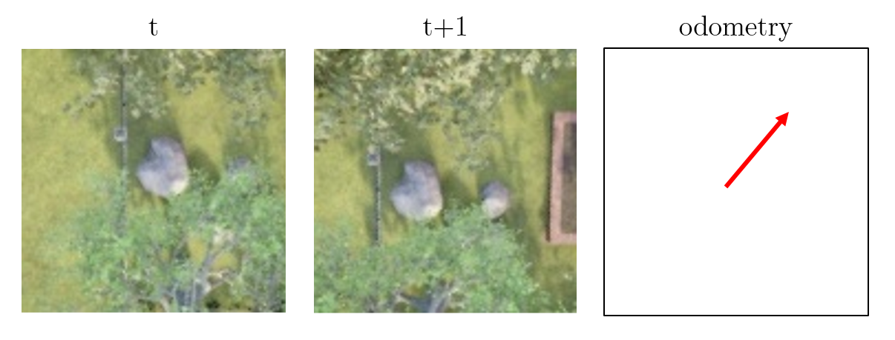
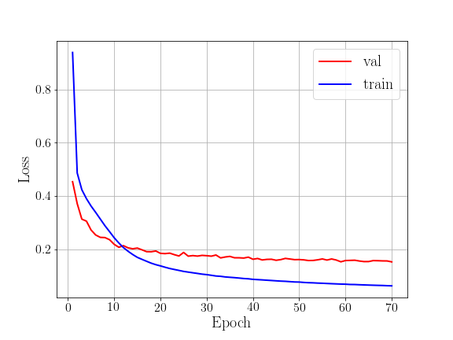

# CNN-VO: Visual Odometry for Autonomous UAVs in GNSS Contested Environments with Deep Learning

[](https://github.com/aofrancani/KDD-BR22/blob/main/LICENSE)

This is my implementation for the competition "[KDD-BR 2022 - Visual odometry for autonomous UAVs in GNSS contested environments](https://www.kaggle.com/competitions/kddbr-2022/overview)"



The model architecture was based on a UNet encoder with a regression loss. The normalized features `altitude` and `delta` are concatenated in the input of the last multilayer perception. The solution had better performance compared to the two benckmarck solutions provided by the competition.


## 1. Dataset
Download the [KDD-BR22 odometry dataset.](https://www.kaggle.com/competitions/kddbr-2022/data)

Create a simbolic link (Windows) or a softlink (Linux) to the dataset in the `dataset` folder:

- On Windows:
```mklink /D <path_to_project>\KDD-BR22\dataset <path_to_downloaded_dataset>```
- On Linux: 
```ln -s <path_to_your_downloaded_dataset> <path_to_your_project>/KDD-BR22/dataset```

Then, the data structure should be as follows:
```
|---KDD-BR22
    |---dataset
        |---train
		|---000a3f777828d2cdbee98887561aa130.jpg
		|---...
        |---test
		|---000a8e84b013655b832041a6f362e5c9.jpg
		|---...
        |---public.csv
        |---sample_submission.csv		
```

## 2. Download Pre-trained Model and Logs
Download my pre-trained model and save it somewhere in the `ckpt` directory: 
- checkpoint: [Link to GoogleDrive](https://drive.google.com/drive/folders/1vBIvgHW-cVK1a_k0aVENPrK-vR-elYm-?usp=share_link)


## 3. Setup
Create a Python virtual environment and activate it:
```
python -m venv venv
venv\Scripts\activate.bat
```
Install dependencies:
```
pip install -r requirements.txt
```

## 4. Usage
Run `train_model.py` to start training:
```
python train_model.py
```
If you want to keep the training from a checkpoint, change the key `checkpoint_path` of the dictionary `args` in `train_model.py`.


## 5. Evaluation
Test the model with `test_model.py` and generate the submission file:
```
python test_model.py
```

## 6. Results

You can analyse the Tensorboard logs with:
```
tensorboard --logdir <path_to_checkpoint>
```

Training and Validation Loss:



Evaluation Table (RMSE):

|      **Method**      | **Public (RMSE)** | **Private (RMSE)** |
|:--------------------:|:-----------------:|:------------------:|
| CNN-VO (our)         | **0.47896**       | **0.48608**        |
| Benchmark Beta       | 0.51000           | 0.51124            |
| Benchmark Alpha      | 0.61503           | 0.61385            |
| Guessing No Movement | 1.26870           | 1.26918            |


